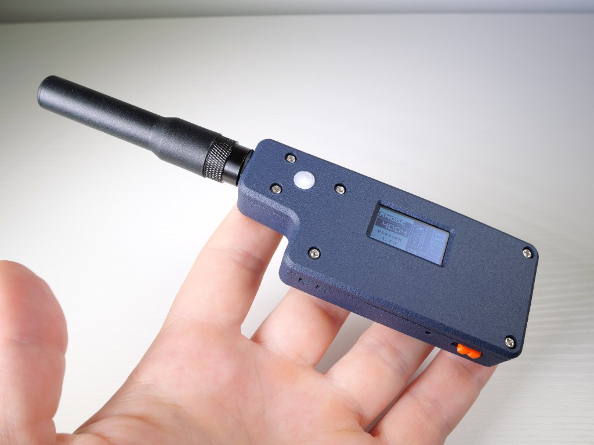
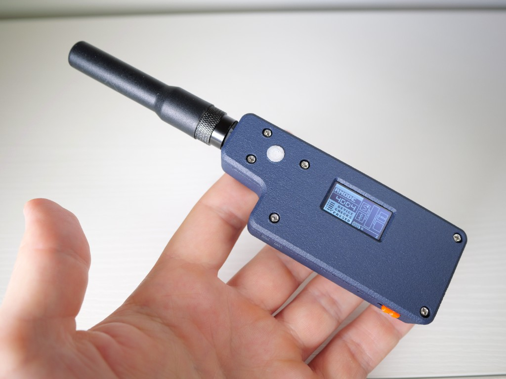
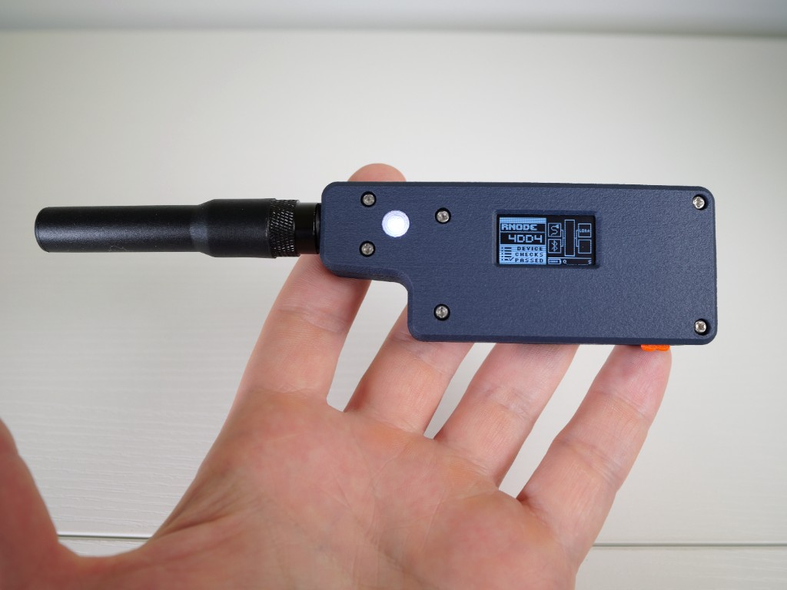
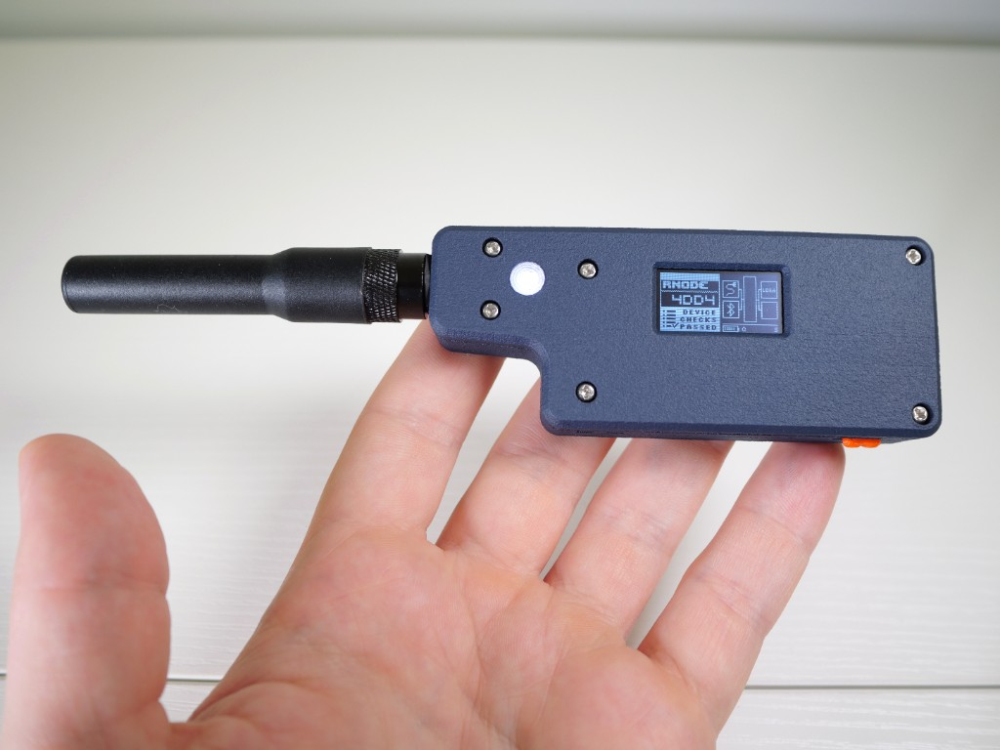
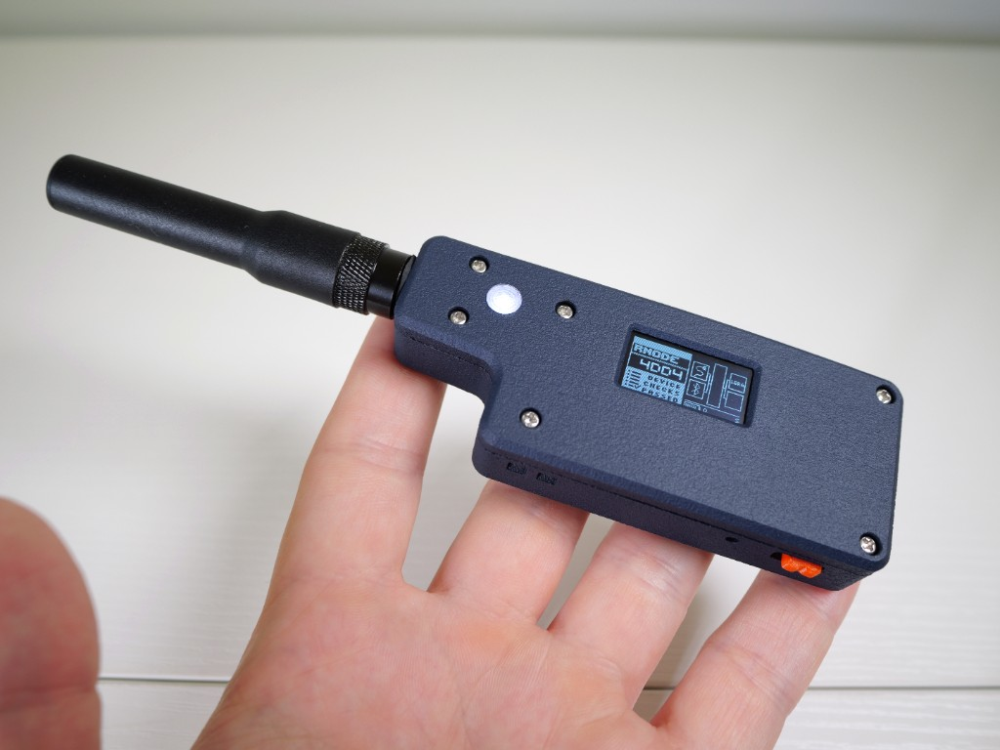

# RNode Firmware — NeoPixel Edition

<p align="center">
  
</p>

A fork of the [RNode Firmware CE (Community Edition)](https://github.com/liberatedsystems/RNode_Firmware_CE) with added NeoPixel status indicator support for ESP32-based boards like the LilyGO LoRa32 v2.1.

The NeoPixel lights up on boot and on every data transfer (RX/TX), giving you an at-a-glance visual indicator that your node is alive and actively relaying traffic.

<p align="center">
  
</p>

## Boot Sequence

When the device powers on, the NeoPixel lights up purple and stays lit while the firmware initializes. The OLED display cycles through hardware init, device checks, and version info — all while the NeoPixel confirms the node is alive.

<p align="center">
  
  
  
</p>

Once checks pass, the device is ready and the NeoPixel remains lit for 60 seconds before turning off. Any RX or TX activity re-triggers it.

<p align="center">
  
</p>

## What's Changed

The upstream firmware already has NeoPixel support for some boards (e.g. NRF52-based RAK4631). This fork extends it to **ESP32-based boards** (specifically the LilyGO LoRa32 v2.1) and adds a **timed activity indicator** so the LED stays lit for a configurable duration after each event:

| Event | Default Color | Default Duration |
|-------|--------------|-----------------|
| Boot  | Purple (128, 0, 128) | 60 seconds |
| RX (receive) | White (255, 255, 255) | 30 seconds |
| TX (transmit) | Blue (0, 0, 255) | 30 seconds |

After the timeout, the LED turns off automatically. Any new activity resets the timer.

### NeoPixel Pin — GPIO 13, not GPIO 12

[Mark Qvist's original build guide](https://unsigned.io/guides/2023_01_14_Making_A_Handheld_RNode.html) suggests wiring the NeoPixel data line to **GPIO 12**. We found that **GPIO 12 does not work** — it's a strapping pin on the ESP32 that controls the flash voltage regulator at boot. If it's pulled high by the NeoPixel data line during reset, the board can fail to boot entirely or behave erratically.

This fork defaults to **GPIO 13** instead, which works reliably. If you've already built your RNode following the original guide, you'll need to move the data wire from GPIO 12 to GPIO 13 (they're right next to each other on most ESP32 boards).

You can override the pin at compile time if you've wired to a different GPIO:

```cpp
#define PIN_NEOPIXEL 13
```

## Configuration

All NeoPixel parameters can be overridden with `#define` before including `Config.h` (or passed as build flags):

```cpp
// Timeouts (milliseconds)
#define NP_BOOT_TIMEOUT_MS 60000
#define NP_RX_TIMEOUT_MS   30000
#define NP_TX_TIMEOUT_MS   30000

// Boot color (RGB 0-255)
#define NP_BOOT_R 128
#define NP_BOOT_G 0
#define NP_BOOT_B 128

// Receive color
#define NP_RX_R 255
#define NP_RX_G 255
#define NP_RX_B 255

// Transmit color
#define NP_TX_R 0
#define NP_TX_G 0
#define NP_TX_B 255
```

## Flashing the Pre-Built Firmware

A known-good pre-built binary for the LilyGO LoRa32 v2.1 is included in the `Release/` directory. You can flash it directly without compiling anything.

### Prerequisites

- [arduino-cli](https://arduino.github.io/arduino-cli/) installed
- ESP32 core installed (`make prep-esp32`, or `arduino-cli core install esp32:esp32@2.0.17 --config-file arduino-cli.yaml`)
- Your RNode connected via USB

### Find your serial port

```bash
# macOS
ls /dev/cu.usb*

# Linux
ls /dev/ttyACM* /dev/ttyUSB*
```

### Flash

```bash
arduino-cli upload -p /dev/cu.usbserial-XXXX \
  --fqbn esp32:esp32:ttgo-lora32 \
  --input-file Release/rnode_firmware_lora32v21_neopixel.bin
```

Replace `/dev/cu.usbserial-XXXX` with your actual serial port.

After flashing, set the firmware hash so `rnodeconf` recognizes the device:

```bash
rnodeconf /dev/cu.usbserial-XXXX --firmware-hash $(./partition_hashes Release/rnode_firmware_lora32v21_neopixel.bin)
```

### Flash the console image (optional)

The [RNode Bootstrap Console](https://unsigned.io/rnode_bootstrap_console) is stored in a separate SPIFFS partition. To flash it:

```bash
python3 Release/esptool/esptool.py \
  --port /dev/cu.usbserial-XXXX \
  --chip esp32 --baud 921600 \
  --before default_reset --after hard_reset \
  write_flash -z --flash_mode dio --flash_freq 80m --flash_size 4MB \
  0x210000 Release/console_image.bin
```

## Building from Source

To compile the firmware yourself, you need [arduino-cli](https://arduino.github.io/arduino-cli/) installed.

```bash
# Install dependencies (ESP32 core, libraries, etc.)
make prep-esp32

# Build for LilyGO LoRa32 v2.1
make firmware-lora32_v21

# Upload to device (defaults to /dev/ttyACM0, override with port=)
make upload-lora32_v21 port=/dev/cu.usbserial-XXXX
```

The `upload-lora32_v21` target handles flashing the firmware, setting the firmware hash, and writing the console image in one step.

See the upstream [build documentation](Documentation/BUILDING.md) for full details on all supported targets.

## Supported Hardware

This fork is tested on the **LilyGO LoRa32 v2.1** with an external NeoPixel on GPIO 13. It should work on any ESP32-based RNode board with a WS2812/NeoPixel connected to the configured pin.

For the full list of boards supported by the base firmware, see the upstream [RNode Firmware CE](https://github.com/liberatedsystems/RNode_Firmware_CE).

## Credits & Upstream

This project builds on the work of others. Big thanks to:

- **[Mark Qvist](https://unsigned.io)** — Creator of the [Reticulum](https://reticulum.network) network stack, the [original RNode Firmware](https://github.com/markqvist/RNode_Firmware), and the [RNode ecosystem](https://unsigned.io/rnode.html). His [handheld RNode build guide](https://unsigned.io/guides/2023_01_14_Making_A_Handheld_RNode.html) is what got us started, and the NeoPixel wiring in this fork follows his design (with the GPIO 12 to 13 fix). His [blog](https://unsigned.io) and [documentation](https://markqvist.github.io/Reticulum/) are invaluable resources for anyone working with RNodes.

- **[Jacob Eva / Liberated Embedded Systems](https://liberatedsystems.co.uk)** — Maintainer of the [RNode Firmware CE (Community Edition)](https://github.com/liberatedsystems/RNode_Firmware_CE), which this repo is forked from. The CE fork added NeoPixel support for the LilyGO LoRa32 (contributed by [@0x62](https://github.com/0x62) in [PR #71](https://github.com/liberatedsystems/RNode_Firmware_CE/pull/71)) and continues to expand board support.

- **[Reticulum](https://reticulum.network)** — The cryptography-based networking stack that RNodes are designed to work with. None of this would exist without it.

## License

GNU General Public License v3.0 — see [LICENSE](LICENSE) for details.

The upstream RNode Firmware is Copyright 2024 Mark Qvist / [unsigned.io](https://unsigned.io). The RNode Firmware CE is Copyright Jacob Eva / [Liberated Embedded Systems](https://liberatedsystems.co.uk). The SX1276 driver is released under MIT License, Copyright 2018 Sandeep Mistry / Mark Qvist.
